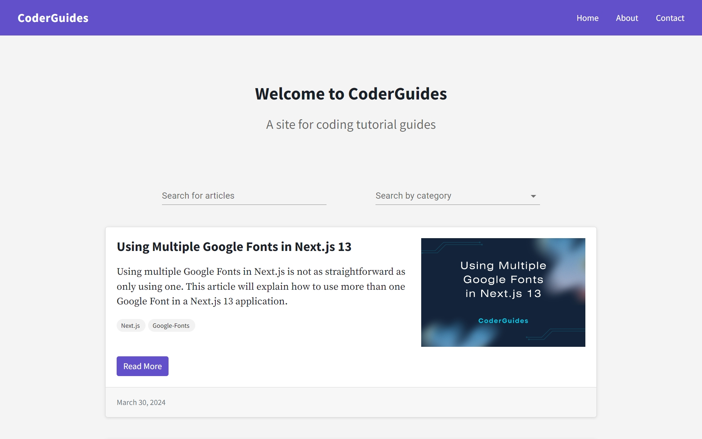
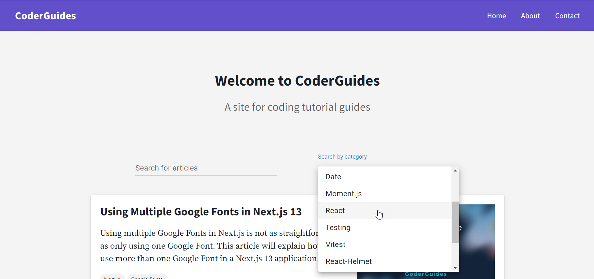
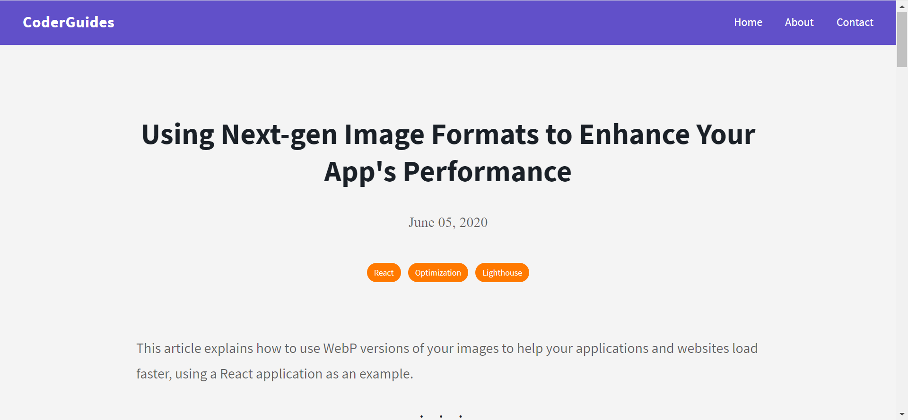
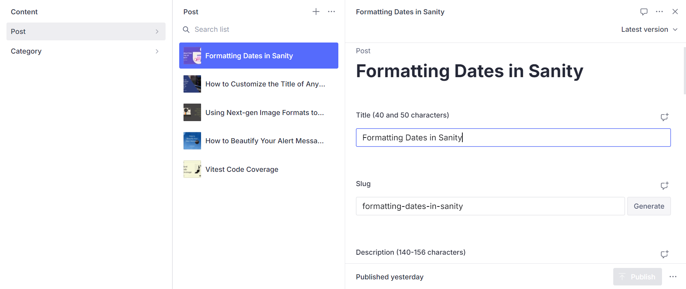

# CoderGuides


## Description

CoderGuides is a blog website built with Next.js and Material UI on the frontend and Sanity CMS on the backend. With Sanity, I am able to manage my content and add, edit, update, and delete articles inside Sanity Studio.

## CoderGuides Live Link

Please check out the live link for CoderGuides here: [CoderGuides](https://coderguides.vercel.app/ "CoderGuides")

## Table of Contents
* [Technologies Used](#Technologies-Used)
* [Development](#Development)
* [Screenshots](#Screenshots)

## Technologies Used

* Next.js
* Sanity CMS
* Material UI
* date-fns
* React-Scroll-Up-Button
* Prism.js
* CSS (CSS Modules)
* Flexbox
* Google Fonts
* Facebook Developer Tools (Sharing Debugger)
* Vercel

[Back To Top](#Table-of-Contents)

## Development

CoderGuides is a fully functioning responsive website built with Next.js and Material UI on the frontend and Sanity CMS on the backend. As new articles are added, they appear at the top of the home page, where the newest articles are listed at the top. A user can click on individual articles to read, where they are directed to the article page. In addition, a visitor to the site can search by article, as well as search by category (e.g., React, Testing, JavaScript, etc.). Since this is a blog website focused on web development and coding, I used Prism.js for syntax highlighting so that I am able to use code snippets in my articles as needed. To be able to use syntax highlighting, I set up and configured the Sanity Studio Portable Text editor, so that I would be able to add code snippets when in articles. In the following example, I made the following configuration in `blockContent.js` so that I would be able to use the following languages in Sanity's text editor.

```javascript
  defineArrayMember({
    type: 'code',
    options: {
      language: 'JavaScript',
      languageAlternatives: [
        { title: 'HTML', value: 'html' },
        { title: 'CSS', value: 'css' },
        { title: 'JavaScript', value: 'js' },
        { title: 'JSX', value: 'jsx' },
        { title: 'SASS', value: 'sass' },
        { title: 'Liquid', value: 'liquid' },
        { title: 'Bash', value: 'bash' },
      ]
    }
  }),
  ```

Since this is a site that I would be adding articles to, I used Sanity, a content management system, so that the I would be able to add and fetch my article data. Sanity uses GROQ, its own open-source query language, using the schemas that I created. The following example is the GROQ query taken from the Home Page component in `index.js`. The code is put inside a `useEffect` so that the data is fetched when the component loads so that it displays on the page. In addition, since it is possible for articles to share the same category (more than one article may have the same "React" category, for example), the duplicates are removed, ensuring that there are no duplicates to be found later on when writing the code for the "Search by category" search menu. Additionally, each article card will have its own categories displayed in badges so that a visitor to the site knows the categories for each article. Finally, the collection here is sorted in descending (`desc`) order.


```javascript
  useEffect(() => {
    client.fetch(
      `*[_type == "post"] | order(publishedAt desc){
          title,
          slug,
          body,
          description,
          mainImage {
              asset -> {
                  _id,
                  url
              },
              alt
          },
          publishedAt,
          "categories": categories[]->title
      }`
    ).then((data) => {
      setPosts(data);

      // Get unique categories and remove duplicates
      const uniqueCategories = [...new Set(data.flatMap(post => post.categories))];
      setCategories(uniqueCategories);
    }).catch(console.error);
  }, []);
  ```

The following is the schema in `post.js` that is used to add the data for individual posts (articles):

```javascript
import { defineField, defineType } from 'sanity';

export default defineType({
  name: 'post',
  title: 'Post',
  type: 'document',
  fields: [
    defineField({
      name: 'title',
      title: 'Title (40 and 50 characters)',
      type: 'string',
    }),
    defineField({
      name: 'slug',
      title: 'Slug',
      type: 'slug',
      options: {
        source: 'title',
        maxLength: 96,
      },
    }),
    defineField({
      name: 'description',
      title: 'Description (140-156 characters)',
      type: 'string',
    }),
    defineField({
      name: 'mainImage',
      title: 'Main image',
      type: 'image',
      options: {
        hotspot: true,
      },
    }),
    defineField({
      name: 'categories',
      title: 'Categories',
      type: 'array',
      of: [{ type: 'reference', to: { type: 'category' } }],
    }),
    defineField({
      name: 'publishedAt',
      title: 'Published at',
      type: 'datetime',
    }),
    defineField({
      name: 'body',
      title: 'Body',
      type: 'blockContent',
    }),
  ],
});

```

[Back To Top](#Table-of-Contents)

## Screenshots









[Back To Top](#Table-of-Contents)
