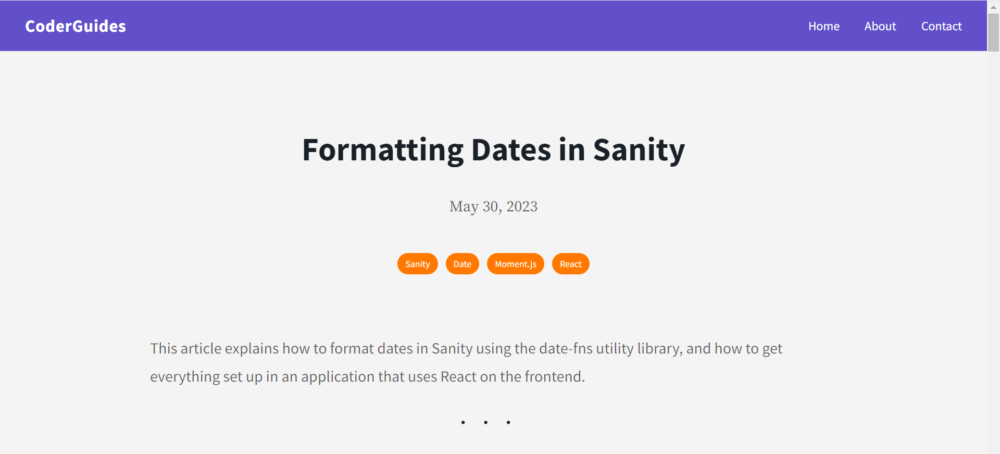
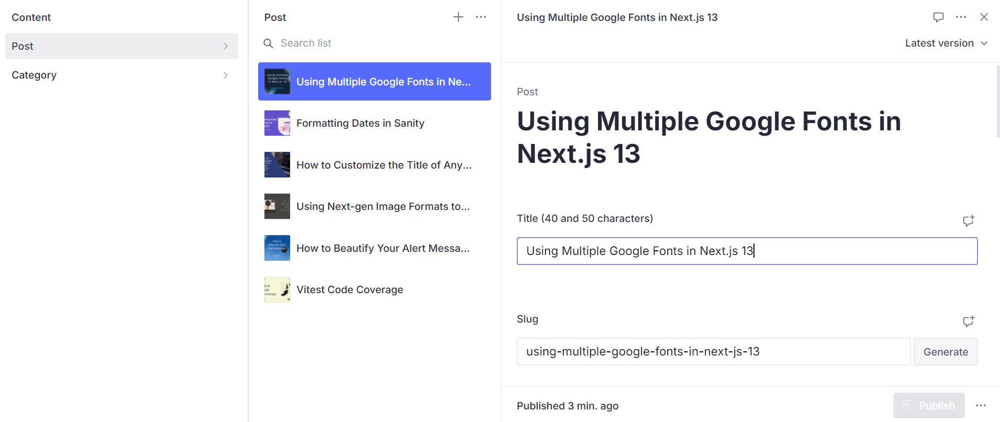

# CoderGuides


## Description

Official portfolio website I designed and built for a client, a Korean model who wanted a website to showcase her modeling work and have a way for others to reach out to her for bookings or inquiries with a contact form. By using the Sanity CMS for the website, the client is able to manage her own content on the website.

## CoderGuides Live Link

Please check out the live link for CoderGuidese here: [CoderGuides]([https://jisunkim.netlify.app/](https://coderguides.vercel.app/) "CoderGuides")

## Table of Contents
* [Technologies Used](#Technologies-Used)
* [Development](#Development)
* [Screenshots](#Screenshots)

## Technologies Used

* Next.js
* Sanity CMS
* Material UI
* date-fns
* React-Scroll-Up-Button
* Prism.js
* Material Icons
* CSS (CSS Modules)
* Flexbox
* Google Fonts
* Facebook Developer Tools (Sharing Debugger)
* Vercel

[Back To Top](#Table-of-Contents)

## Development

The client wanted a portfolio website with a clean design to showcase her modeling work, particulary a selection of photos and videos of her work, as well as a way for others to reach out to her for bookings or inquiries. In order for her to have complete control of her content, I built the website using Sanity, a Content Management System. That way, the client would be able to manage her website's content on her own (e.g., adding and deleting photos and videos, as well as updating and editing text, such as her bio and samples of work on the About Page).

To enhance the showcasing of her photos, I used React Grid Gallery, an image gallery for React that has a design that fit with what the client wanted for the Photos Page. Since the client intends to have a number of photos on show, this gallery is exactly what she had in mind. Furthermore, I also added the use of Lightbox2 so that when a visitor to the site clicks on an image, you get a closer look at the clicked-on image while dimming and disabling the rest of the background, giving a stunning effect that goes well with the image gallery. For animations, I used Framer Motion in certain places, such as on the Landing Page, Photos Page, and Videos Page, for some nice animated effects.

To build the website, I used Sanity so that the client would be able to add and fetch data from Sanity. Sanity uses GROQ, its own open-source query language, as well as schemas that I created. The following example is the GROQ query taken from the Videos Page component in `Videos.js`. The code is put inside a `useEffect` so that the data is fetched when the component loads so that it displays on the page. In this case, the videos (`videoUrl`). The `title` is also fetched. Here, however, the title is not disaplayed on the page. Rather, it is an attribute used to describe the contents of the frame. Finally, the collection here is sorted in descending (`desc`) order.

```javascript
  const [videoData, setVideoData] = useState(null);
  
  useEffect(() => {
    sanityClient
      .fetch(
        `*[_type == "videos"] | order(_createdAt desc) {
          videoUrl,
          title
        }`
      )
      .then((data) => setVideoData(data))
      .catch(console.error);
  }, []);
  ```


The following is the schema in `post.js` that is used to add the data for individual posts (articles):

```javascript
import { defineField, defineType } from 'sanity';

export default defineType({
  name: 'post',
  title: 'Post',
  type: 'document',
  fields: [
    defineField({
      name: 'title',
      title: 'Title (40 and 50 characters)',
      type: 'string',
    }),
    defineField({
      name: 'slug',
      title: 'Slug',
      type: 'slug',
      options: {
        source: 'title',
        maxLength: 96,
      },
    }),
    defineField({
      name: 'description',
      title: 'Description (140-156 characters)',
      type: 'string',
    }),
    defineField({
      name: 'mainImage',
      title: 'Main image',
      type: 'image',
      options: {
        hotspot: true,
      },
    }),
    defineField({
      name: 'categories',
      title: 'Categories',
      type: 'array',
      of: [{ type: 'reference', to: { type: 'category' } }],
    }),
    defineField({
      name: 'publishedAt',
      title: 'Published at',
      type: 'datetime',
    }),
    defineField({
      name: 'body',
      title: 'Body',
      type: 'blockContent',
    }),
  ],
});

```

[Back To Top](#Table-of-Contents)

## Screenshots






[Back To Top](#Table-of-Contents)
